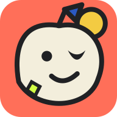
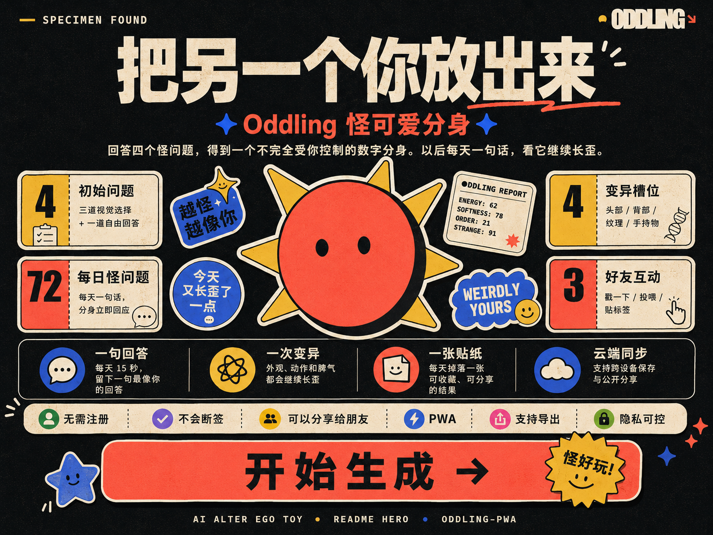

# Oddling

<p align="center">
  
</p>

<p align="center">
  <strong>AI ALTER EGO TOY</strong><br/>
  Let the other you out.
</p>

<p align="center">
  
</p>

<p align="center">
  
  
  
  
  
</p>

<p align="center">
  <a href="https://oddling-pwa.vercel.app"><strong>Try it now →</strong></a>
</p>

---

## What is this

Oddling is an AI alter-ego raising toy. Answer four odd questions and get a digital creature that looks weirdly like you — but not entirely under your control.

One sentence a day from then on. Watch it keep growing weirder.

- **No sign-up required** — open and play
- **No streak punishment** — no FOMO mechanics
- **Rename anytime** — but no face-tweaking. The surprise of first meeting is the whole point

---

## How to play

### 15 seconds a day, three steps

| Step | You do | Your Oddling does |
|------|--------|-------------------|
| **One answer** | Reply to today's odd question | No long diary, just the sentence that feels most like you today |
| **One mutation** | Hit send | Appearance, motion, and mood shift visibly and stick in history |
| **One sticker** | Collect the drop | A shareable, keepable result every day |

### Friends can join too

- Share your Oddling link — friends interact **without signing up**
- Friends leave relationship stickers and events
- Once a friend creates their own Oddling, unlock **dual-character relationship events**

---

## Visual style

Weird-cute sticker zine. Cream paper, thick black outlines, coral red and cobalt blue, handmade edges, high-feedback motion — collectible, screenshot-worthy, and spreadable.

---

## Run locally

```bash
npm install
npm run dev
```

Without environment variables, Oddling enters local demo mode automatically — all state stays in your browser.

For cloud persistence and cross-device sharing, copy `.env.example` to `.env.local` and fill in your Supabase credentials.

---

## Install on phone / desktop

Oddling is a PWA. No App Store or Play Store submission needed:

- **iPhone / iPad**: Open in Safari → Share → Add to Home Screen
- **Android**: Open in Chrome → Install app
- **Desktop**: Chrome / Edge address bar → Install

---

## Tech stack

Next.js 16 + React 19 + Supabase + Tailwind CSS + Motion

---

## License

MIT
