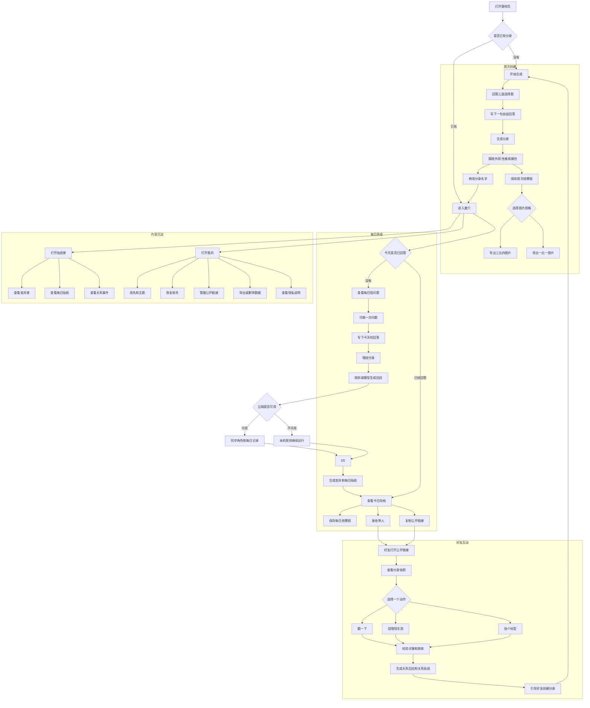

# Oddling 完整体验流程

```mermaid
flowchart TD
    A[打开落地页] --> B{是否已有分身}
    B -->|没有| C[开始生成]
    B -->|已有| H[进入巢穴]

    subgraph 首次创建
      C --> C1[回答三道选择题]
      C1 --> C2[写下一句自由回答]
      C2 --> C3[生成分身]
      C3 --> C4[揭晓外观 性格和属性]
      C4 --> C5[修改分身名字]
      C4 --> C6[保存首次结果图]
      C6 --> C7{选择图片规格}
      C7 --> C8[导出三比四图片]
      C7 --> C9[导出一比一图片]
      C5 --> H
    end

    subgraph 每日养成
      H --> H1{今天是否已回答}
      H1 -->|没有| D[查看每日怪问题]
      D --> D1[可换一次问题]
      D1 --> D2[写下今天的回答]
      D2 --> D3[喂给分身]
      D3 --> D4[规则或模型生成回应]
      D5 --> D6[生成变异和每日贴纸]
      D6 --> E[查看今日存档]
      H1 -->|已经回答| E
      E --> E1[保存每日结果图]
      E --> E2[发给熟人]
      E --> E3[复制公开链接]
    end

    subgraph 内容沉淀
      H --> F[打开贴纸册]
      F --> F1[查看变异谱]
      F --> F2[查看每日贴纸]
      F --> F3[查看关系事件]
      H --> G[打开我的]
      G --> G1[改名和主题]
      G --> G2[恢复账号]
      G --> G3[管理公开链接]
      G --> G4[导出或删除数据]
      G --> G5[查看隐私说明]
    end

    subgraph 好友互动
      E2 --> I[好友打开公开链接]
      E3 --> I
      I --> I1[查看分身快照]
      I1 --> I2{选择一个动作}
      I2 --> I3[戳一下]
      I2 --> I4[投喂怪东西]
      I2 --> I5[贴个标签]
      I3 --> I6[校验访客和频率]
      I4 --> I6
      I5 --> I6
      I6 --> I7[生成关系回应和关系贴纸]
      I7 --> I8[引导好友创建分身]
      I8 --> C
    end

    D4 --> J{云端是否可用}
    J -->|可用| J1[同步角色和每日记录]
    J -->|不可用| J2[本机规则继续运行]
    J1 --> D5
    J2 --> D5
```
